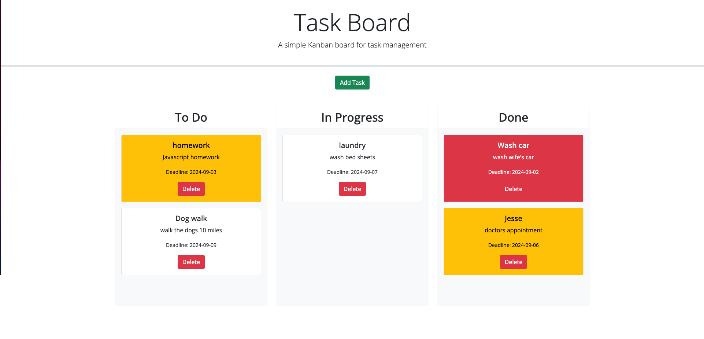
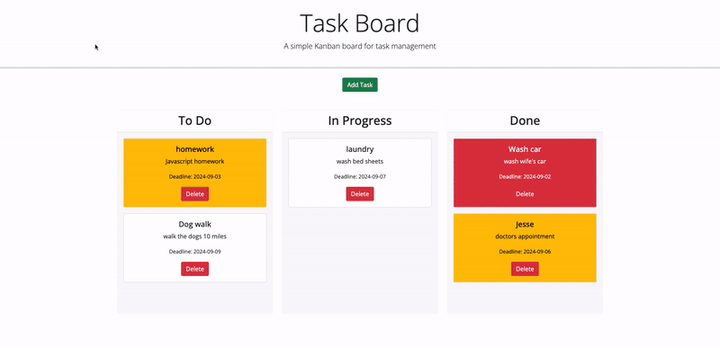
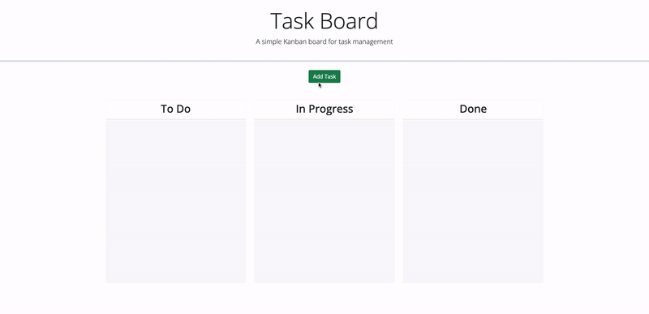

# Task Board Application

Welcome to the Task Board Application! This is a simple Kanban-style task board application that allows a team to manage project tasks by dynamically updating HTML and CSS powered by jQuery. The app runs in the browser and uses localStorage to persist data.

## Table of Contents

- [Task Board Application](#task-board-application)
- [Table of Contents](#table-of-contents)
- [Description](#description)
- [Features](#features)
- [Installation](#installation)
- [Usage](#usage)
- [Technologies Used](#technologies-used)


## Description

The Task Board Application is designed for project teams to manage tasks effectively. Users can add tasks, categorize them based on their progress, and track deadlines. Tasks are color-coded to indicate urgency, and the application uses drag-and-drop functionality to move tasks between different stages of completion.

The images below demonstrates the functionality of the application:






## Features

- **Task Management**: Add, edit, delete, and track tasks.
- **Progress Tracking**: Organize tasks into "To Do", "In Progress", and "Done" columns.
- **Drag-and-Drop**: Move tasks between columns using drag-and-drop.
- **Deadline Alerts**: Tasks nearing their deadlines are highlighted in yellow, and overdue tasks are highlighted in red.
- **Persistent Storage**: All tasks are saved to localStorage and persist across page reloads.
- **Responsive Design**: The application is responsive and works across different devices and screen sizes.

## Installation

To run this project locally, follow these steps:

1. **Clone the Repository:**
   ```bash
   git clone https://github.com/markjas0n/upgraded-goggles.git
2. **Navigate to the Project Directory:**
    ```bash
    cd upgraded-goggles
3. **Open the Project in VS Code:**
    ```bash
    code .
4. **Install Live Server Extension (if not already installed)**
  - Install the Live Server extension in VS Code for easier testing.
5. **Run the Application:**
- Open the index.html file and right-click to "Open with Live Server".

## Usage 
1. #### Add a Task:
- Click the "Add Task" button to open the modal.
- Fill in the title, description, and deadline for the task.
- Click "Save Task" to add the task to the "To Do" column.
2. #### Move a Task:
- Drag a task card and drop it into the desired column ("To Do", "In Progress", or "Done").
#### Delete a Task:
- Click the "Delete" button on a task card to remove it from the board.
#### Track Task Deadlines:
- Tasks nearing their deadline are highlighted in yellow.
- Overdue tasks are highlighted in red.
#### Reload the Page:
- Tasks will persist even after the page is reloaded, thanks to localStorage.

### Technologies Used

- HTML5
- CSS3
- JavaScript
- jQuery
- jQuery UI (for drag-and-drop functionality)
- Day.js (for date handling)
- Bootstrap (for styling and layout)
- Google Fonts (for custom fonts)
- Font Awesome (for icons)